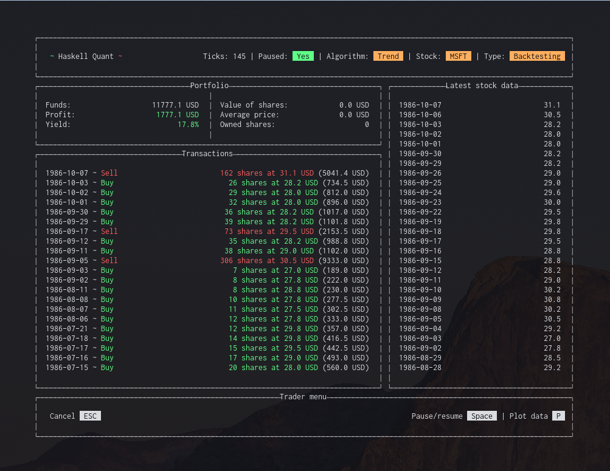

# Haskell quant
Haskell Quant is a proof-of-concept application to simulate the use of trading algorithms in the stock market. The algorithms can be applied to either historic- or real-time stock data, depending on what the user want to achieve. It does not provide the user with the ability to trade with real money, nor do we encourage anyone to use the application in such a way. It is a trading platform for developing, testing and mainting trading algorithms. Implemented with a TUI using brick and live stock data collected with IEXCloud.



## Setup
Uncomment and set `-- allow-newer: False` to `allow-newer: True` in `~/.cabal/config`

If you are running Arch you must enable dynamic libraries:
```zsh
$ cabal v2-configure --disable-library-vanilla --enable-shared --enable-executable-dynamic --ghc-options=-dynamic
```

If you want to use realtime data from IEXCloud, you must enter your publishable API-key into `iexApiKey` in `src/Service/Market.hs`.

## How to run
After setup, simply run:
```zsh
$ cabal v2-run
```
If you want to exit, simply press:
```zsh
CTRL-Q
```

## Demo user
In order to log in and test the program, use the following credentials.
```zsh
Username: demo
Password: 123
```

## Running the program in GHCI
```zsh
$ cabal v2-repl <module-name or nothing>
```

## Matplotlib
To get a better understanding of how the algorithm works, you can plot the buy and sell orders on a graph along with the price and a few selected indicators.
This is done using python's matplotlib and so requires you to install it using the following commands:

```zsh
$ python3 -m pip install matplotlib
$ python3 -m pip install scipy
```

## IEXCloud usage
To use the sandbox, append a `'` to the function name.

## Resources
### Brick (Text-based user interface)
[Brick haskell](http://hackage.haskell.org/package/brick)

[Github README Brick haskell](https://github.com/jtdaugherty/brick/blob/master/README.md)

[Examples](https://github.com/jtdaugherty/brick/tree/master/programs)

[Drop Down Menu](http://hackage.haskell.org/package/brick-dropdownmenu-0.1.0/docs/Brick-Widgets-DropDownMenu.html)

### IEXCloud
[Stocks haskell](http://hackage.haskell.org/package/iexcloud)

#### Trading terminology
[Warriortrading traiding terms](https://www.warriortrading.com/day-trading-terminology/)

#### Time Module
[Introduction to the Time library](https://williamyaoh.com/posts/2019-09-16-time-cheatsheet.html)
